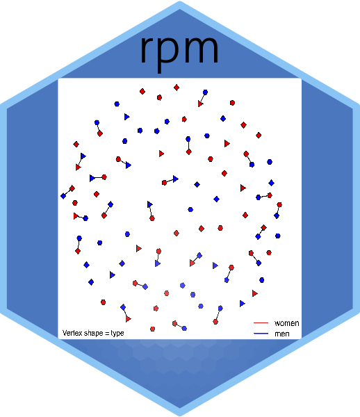

# The rpm package
This is an R package to estimate revealed preferences based on observed bipartite matchings.

Many problems in demography require models for partnership formation that
separate latent preferences for partners from the availability of partners.
This package consider models for matchings within a bipartite population where
individuals have utility for people based on observed and unobserved characteristics.
People can form a partnership or remain unpartnered.  The models represent both
the availability of potential partners of different types and preferences of
individuals for such people.

We develop a large-population likelihood framework to estimate
preference parameters based on sample survey data on partnerships and population
composition. The framework was originally due to Menzel (2015).
Based on simulation studies conducted in See Goyal, Handcock, Jackson, Rendall and Yeung (2022),
for realistic population sizes, the model recovers preference parameters that are
invariant under different population availabilities.  The software uses bootstrap methods to bias
correct parameter estimates for small population sizes and produce confidence intervals 
that have the correct coverage.  

The package was originally developed by Ryan M. Admiraal and Mark S. Handcock.

# Installation

The package is available on CRAN and can be installed using

```{r}
install.packages("rpm")
```

## Installation of the development version
To install it, you can also use:
```
# If devtools is not installed:
# install.packages("devtools")

devtools::install_github("handcock/rpm")
```
## Resources

To run an example use:
```
library(rpm)
data(fauxmatching)
fit <- rpm(~match("edu") + WtoM_diff("edu",3),
          Xdata=fauxmatching$Xdata, Zdata=fauxmatching$Zdata,
          X_w="X_w", Z_w="Z_w",
          pair_w="pair_w", pair_id="pair_id", Xid="pid", Zid="pid",
          sampled="sampled")
summary(fit)
```

For details on how to construct data for input to `rpm()` see the documentation:
```
help(fauxmatching)
```

For information on the current terms that can be used in formulas for `rpm()` see the documentation:
```
help("rpm-terms")
```

# Software bugs and questions

Please use the GitHub repository to report bugs or request features: https://github.com/handcock/rpm

See the following papers for more information and examples:

#### Statistical Methodology

* Menzel, Konrad (2015) [Large Matching Markets as Two-Sided Demand Systems](https://doi.org/10.3982/ECTA12299), *Econometrica*, Vol. 83, No. 3 (May, 2015), 897-941.
* Goyal, Shuchi, Handcock, Mark S., Jackson, Heide M, Rendall, Michael S., Yeung, Fiona C. (2022) [A Practical Revealed Preference Model for
* Separating Preferences and Availability Effects in Marriage Formation](https://doi.org/10.1214/14-ejs923), *Journal of the Royal Statistical Society*, A.
